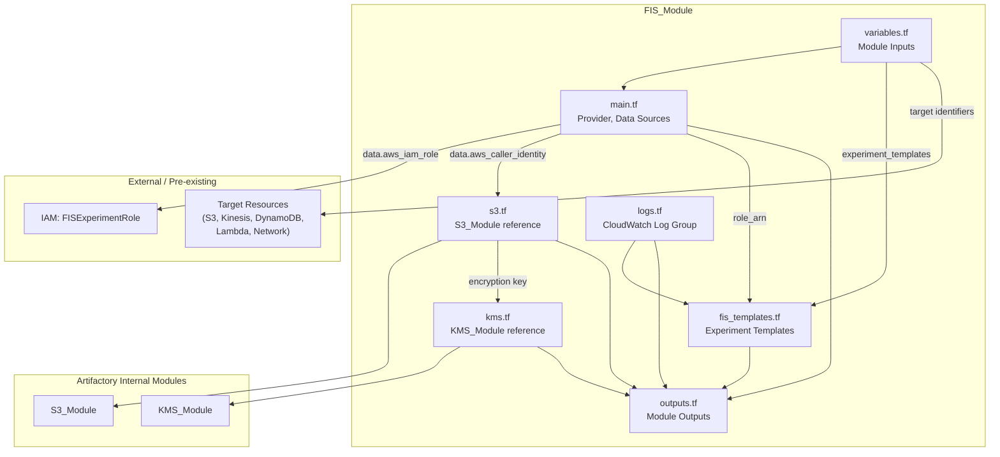
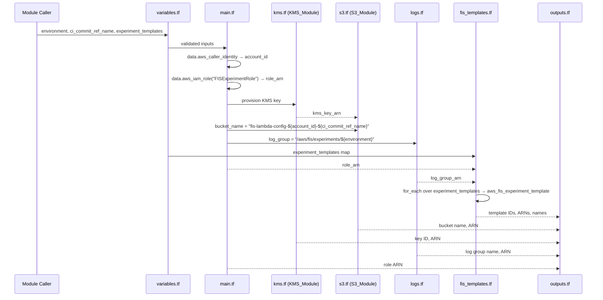
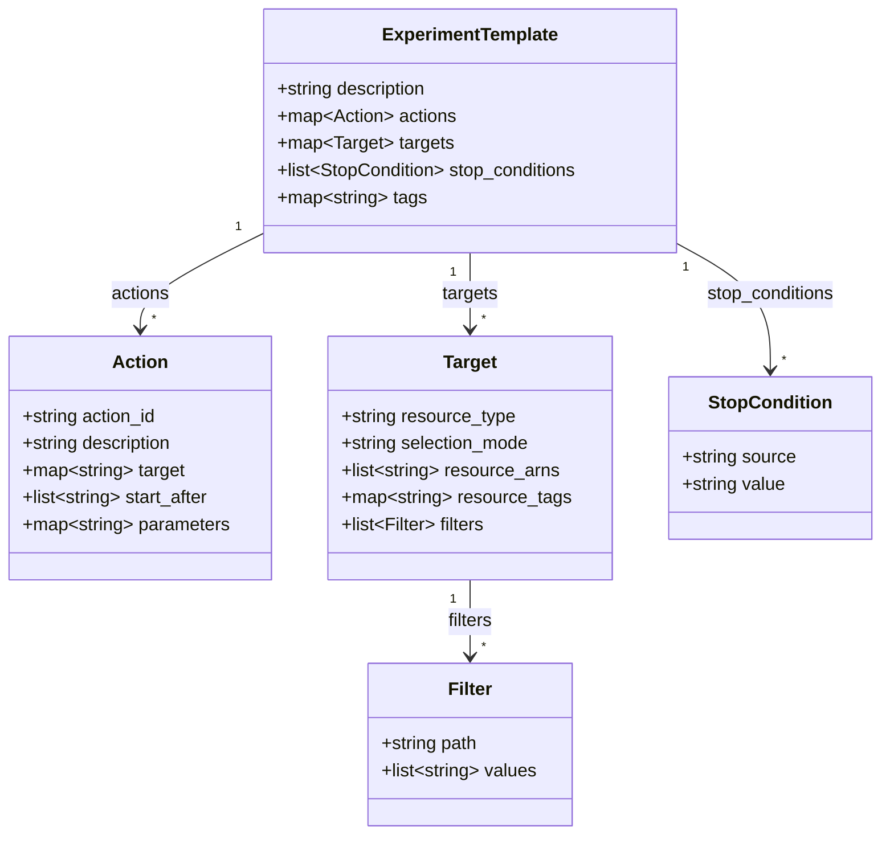

# Design Document: AWS FIS Terraform Module

## Overview

This design describes a Terraform module (`FIS_Module`) that provisions AWS Fault Injection Service experiment templates and supporting infrastructure. The module:

- Creates `aws_fis_experiment_template` resources from a structured, provider-aligned input map
- Provisions a single KMS-encrypted S3 bucket (via internal `S3_Module` and `KMS_Module`) for Lambda fault-injection config artifacts
- Creates a single shared CloudWatch Logs log group for experiment execution logs
- Looks up the pre-existing `FISExperimentRole` IAM role via data source — never creates IAM resources
- Accepts target resource identifiers as inputs — never creates workload resources

The module enforces minimal validation at the module level. The Terraform AWS provider and AWS FIS API are the authoritative validators for action/target compatibility and parameter correctness. The one exception is `Selection_Mode` bounds checking (`COUNT(n) > 0`, `PERCENT(n) 1–100`).

### Key Design Decisions

| Decision | Rationale |
|---|---|
| Provider-aligned input schema | Reduces mapping complexity; users familiar with `aws_fis_experiment_template` can adopt quickly |
| Hardcoded `FISExperimentRole` | Single-role convention simplifies lookup; no IAM creation in module scope |
| Shared CloudWatch log group | Low FIS log volume; one log group per environment is sufficient |
| Minimal module-level validation | Provider/API catch most errors with better messages; module validates only what it must |
| Internal S3/KMS modules from Artifactory | Organizational compliance; no direct `aws_s3_bucket` or `aws_kms_key` resources |
| Tag-gating deferred | Documented as future work; optional tag selectors accepted but not enforced |
| No multi-account support | Scoped to single-account experiments only |

## Architecture

### High-Level Module Diagram




### Data Flow



## Components and Interfaces

### File Layout

| File | Responsibility |
|---|---|
| `main.tf` | Provider configuration, `data.aws_caller_identity`, `data.aws_iam_role` lookup |
| `variables.tf` | All module input variables with types, defaults, descriptions, and validation blocks |
| `kms.tf` | `KMS_Module` invocation for S3 encryption key |
| `s3.tf` | `S3_Module` invocation for Lambda config bucket |
| `logs.tf` | `aws_cloudwatch_log_group` for shared experiment logs |
| `fis_templates.tf` | `aws_fis_experiment_template` resources via `for_each` |
| `outputs.tf` | All module outputs |

### Module Inputs (`variables.tf`)

#### Required Inputs

| Variable | Type | Description |
|---|---|---|
| `environment` | `string` | Environment name used in template naming and log group path |
| `ci_commit_ref_name` | `string` | GitLab CI/CD branch/tag ref used in S3 bucket naming |
| `experiment_templates` | `map(object({...}))` | Map of experiment template definitions (see schema below) |

#### `experiment_templates` Object Schema

```hcl
variable "experiment_templates" {
  description = "Map of FIS experiment template definitions"
  type = map(object({
    description = optional(string, "")
    
    # Actions block — maps directly to aws_fis_experiment_template action blocks
    actions = map(object({
      action_id   = string                       # FIS action type ID (e.g., "aws:s3:bucket-pause-replication")
      description = optional(string, "")
      target      = optional(map(string), {})    # key = target key reference within this template
      start_after = optional(list(string), [])   # action dependency ordering
      parameters  = optional(map(string), {})    # action-specific parameters (e.g., duration)
    }))

    # Targets block — maps directly to aws_fis_experiment_template target blocks
    targets = map(object({
      resource_type  = string                    # FIS resource type (e.g., "aws:s3:bucket")
      selection_mode = optional(string, "ALL")   # ALL | COUNT(n) | PERCENT(n)
      resource_arns  = optional(list(string), [])
      resource_tags  = optional(map(string), {}) # optional tag-based selection
      filters        = optional(list(object({
        path   = string
        values = list(string)
      })), [])
    }))

    # Stop conditions
    stop_conditions = optional(list(object({
      source = string                            # "none" or "aws:cloudwatch:alarm"
      value  = optional(string, "")              # alarm ARN when source is cloudwatch
    })), [{ source = "none", value = "" }])

    # Tags for the template resource itself
    tags = optional(map(string), {})
  }))
}
```

#### Template Naming

Each template is named `fis-{service}-{scenario}-{environment}` where the map key encodes `{service}-{scenario}`. The module constructs the full name by appending `-{environment}`.

### Module Outputs (`outputs.tf`)

| Output | Type | Description |
|---|---|---|
| `experiment_role_arn` | `string` | Resolved ARN of `FISExperimentRole` |
| `s3_bucket_name` | `string` | Name of the Lambda config S3 bucket |
| `s3_bucket_arn` | `string` | ARN of the Lambda config S3 bucket |
| `kms_key_id` | `string` | ID of the KMS key used for S3 encryption |
| `kms_key_arn` | `string` | ARN of the KMS key |
| `experiment_templates` | `map(object({id, arn, name}))` | Map of created template metadata keyed by template key |
| `log_group_name` | `string` | Name of the shared CloudWatch log group |
| `log_group_arn` | `string` | ARN of the shared CloudWatch log group |


### Component Details

#### `main.tf` — Provider and Data Sources

```hcl
data "aws_caller_identity" "current" {}

data "aws_iam_role" "fis_experiment_role" {
  name = "FISExperimentRole"
}
```

- `aws_caller_identity` resolves `account_id` for S3 bucket naming — no user input needed.
- `aws_iam_role` lookup fails with a clear Terraform error if the role doesn't exist, satisfying Requirement 3.3.

#### `kms.tf` — KMS Key via Internal Module

```hcl
module "fis_kms" {
  source = "artifactory.example.com/terraform-modules/kms"
  # Module-specific arguments per internal KMS_Module interface
  description = "KMS key for FIS Lambda config S3 bucket"
  tags        = { Environment = var.environment }
}
```

#### `s3.tf` — S3 Bucket via Internal Module

```hcl
module "fis_s3" {
  source = "artifactory.example.com/terraform-modules/s3"
  
  bucket_name    = "fis-lambda-config-${data.aws_caller_identity.current.account_id}-${var.ci_commit_ref_name}"
  kms_key_arn    = module.fis_kms.key_arn
  # Additional S3_Module arguments per internal interface
  tags           = { Environment = var.environment }
}
```

Bucket name validation (≤63 chars) is enforced via a `validation` block on the computed name in `variables.tf` or a `locals` + `check` block.

#### `logs.tf` — Shared CloudWatch Log Group

```hcl
resource "aws_cloudwatch_log_group" "fis_experiments" {
  name              = "/aws/fis/experiments/${var.environment}"
  retention_in_days = 30
  tags              = { Environment = var.environment }
}
```

Single log group shared across all templates. Retention is fixed at 30 days per Requirement 5.7.

#### `fis_templates.tf` — Experiment Templates

```hcl
resource "aws_fis_experiment_template" "this" {
  for_each = var.experiment_templates

  description = each.value.description
  role_arn    = data.aws_iam_role.fis_experiment_role.arn

  dynamic "action" {
    for_each = each.value.actions
    content {
      name        = action.key
      action_id   = action.value.action_id
      description = action.value.description

      dynamic "target" {
        for_each = action.value.target
        content {
          key   = target.key
          value = target.value
        }
      }

      start_after = action.value.start_after
      parameter   = action.value.parameters
    }
  }

  dynamic "target" {
    for_each = each.value.targets
    content {
      name           = target.key
      resource_type  = target.value.resource_type
      selection_mode = target.value.selection_mode
      resource_arns  = target.value.resource_arns
      resource_tags  = target.value.resource_tags

      dynamic "filter" {
        for_each = target.value.filters
        content {
          path   = filter.value.path
          values = filter.value.values
        }
      }
    }
  }

  dynamic "stop_condition" {
    for_each = length(each.value.stop_conditions) > 0 ? each.value.stop_conditions : [{ source = "none", value = "" }]
    content {
      source = stop_condition.value.source
      value  = stop_condition.value.value != "" ? stop_condition.value.value : null
    }
  }

  log_configuration {
    cloudwatch_logs_configuration {
      log_group_arn = "${aws_cloudwatch_log_group.fis_experiments.arn}:*"
    }
    log_schema_version = 2
  }

  tags = merge(
    { Name = "fis-${each.key}-${var.environment}" },
    each.value.tags
  )
}
```

The `each.key` in the `experiment_templates` map encodes `{service}-{scenario}`, so the template `Name` tag becomes `fis-{service}-{scenario}-{environment}`.

### Validation Logic

The module implements minimal validation:

1. **`environment`** — `validation { condition = length(var.environment) > 0 }` (non-empty)
2. **`ci_commit_ref_name`** — `validation { condition = length(var.ci_commit_ref_name) > 0 }` (non-empty)
3. **S3 bucket name length** — validated via `locals` computation + `check` or `precondition` (≤63 chars)
4. **`selection_mode`** — custom validation logic:

```hcl
locals {
  selection_mode_validations = flatten([
    for tpl_key, tpl in var.experiment_templates : [
      for tgt_key, tgt in tpl.targets : {
        key  = "${tpl_key}.${tgt_key}"
        mode = tgt.selection_mode
        valid = (
          tgt.selection_mode == "ALL" ||
          (can(regex("^COUNT\\((\\d+)\\)$", tgt.selection_mode)) &&
           tonumber(regex("^COUNT\\((\\d+)\\)$", tgt.selection_mode)[0]) > 0) ||
          (can(regex("^PERCENT\\((\\d+)\\)$", tgt.selection_mode)) &&
           tonumber(regex("^PERCENT\\((\\d+)\\)$", tgt.selection_mode)[0]) >= 1 &&
           tonumber(regex("^PERCENT\\((\\d+)\\)$", tgt.selection_mode)[0]) <= 100)
        )
      }
    ]
  ])
}
```

All other validation (action/target compatibility, parameter correctness, resource type validity) is delegated to the Terraform AWS provider and AWS FIS API.

## Data Models

### Experiment Template Input Model



### Resource Naming Conventions

| Resource | Naming Pattern | Example |
|---|---|---|
| Experiment Template (Name tag) | `fis-{service}-{scenario}-{environment}` | `fis-s3-pause-replication-staging` |
| S3 Bucket | `fis-lambda-config-{account_id}-{ci_commit_ref_name}` | `fis-lambda-config-123456789012-main` |
| CloudWatch Log Group | `/aws/fis/experiments/{environment}` | `/aws/fis/experiments/staging` |
| KMS Key (alias) | Per KMS_Module convention | Module-dependent |

### State and Lifecycle

- All resources are managed by Terraform state — no external state management.
- The S3 bucket, KMS key, and log group are singletons per module invocation.
- Experiment templates are created/updated/destroyed via `for_each` keyed on the `experiment_templates` map.
- Removing a key from the map destroys the corresponding template.
- The IAM role is a data source only — never managed by this module.


## Correctness Properties

*A property is a characteristic or behavior that should hold true across all valid executions of a system — essentially, a formal statement about what the system should do. Properties serve as the bridge between human-readable specifications and machine-verifiable correctness guarantees.*

### Property 1: S3 Bucket Name Construction

*For any* valid `account_id` and `ci_commit_ref_name`, the constructed S3 bucket name SHALL equal `"fis-lambda-config-${account_id}-${ci_commit_ref_name}"`.

**Validates: Requirements 2.5**

### Property 2: S3 Bucket Name Length Validation

*For any* `ci_commit_ref_name` value, if the resulting bucket name `"fis-lambda-config-${account_id}-${ci_commit_ref_name}"` exceeds 63 characters, the module SHALL reject the input with a validation error. If the name is ≤63 characters, the module SHALL accept it.

**Validates: Requirements 2.6**

### Property 3: Template Count Equals Input Count

*For any* `experiment_templates` map with N entries, the module SHALL create exactly N `aws_fis_experiment_template` resources, and the output map SHALL contain exactly N entries.

**Validates: Requirements 4.2, 9.4**

### Property 4: Uniform Template Configuration

*For any* set of experiment templates created by the module, every template SHALL reference the same resolved `Experiment_Role_Arn` and the same shared CloudWatch log group ARN.

**Validates: Requirements 4.3, 5.3**

### Property 5: Stop Condition Default

*For any* experiment template where `stop_conditions` is not provided (or is empty), the created template SHALL have exactly one stop condition with `source = "none"`.

**Validates: Requirements 4.5**

### Property 6: Selection Mode Default

*For any* target within an experiment template where `selection_mode` is not specified, the created target SHALL have `selection_mode = "ALL"`.

**Validates: Requirements 4.7**

### Property 7: Selection Mode Validation

*For any* target `selection_mode` value: if it is `COUNT(n)` then `n` must be an integer > 0; if it is `PERCENT(n)` then `n` must be an integer from 1 through 100; if it is `ALL` it is always valid. Any other format or out-of-bounds value SHALL cause a validation error.

**Validates: Requirements 4.10, 4.11, 4.12**

### Property 8: Template Naming Convention

*For any* experiment template with map key `{service}-{scenario}` and module input `environment`, the template Name tag SHALL equal `"fis-{service}-{scenario}-{environment}"`.

**Validates: Requirements 4.16**

### Property 9: Single Deterministic Log Group

*For any* `environment` value and any number of experiment templates (≥0), the module SHALL create exactly one CloudWatch log group named `"/aws/fis/experiments/${environment}"`.

**Validates: Requirements 5.1, 5.2**

### Property 10: Non-Empty Target Identifier Validation

*For any* target that specifies `resource_arns` directly, the module SHALL validate that the list is non-empty. An empty `resource_arns` list (when no `resource_tags` are provided) SHALL cause a validation error.

**Validates: Requirements 7.2**

### Property 11: Output Map Completeness

*For any* experiment template key in the input map, the `experiment_templates` output map SHALL contain a corresponding entry with non-empty `id`, `arn`, and `name` fields.

**Validates: Requirements 9.4**


## Error Handling

### Module-Level Errors

| Error Condition | Mechanism | Message Guidance |
|---|---|---|
| `FISExperimentRole` IAM role not found | `data.aws_iam_role` lookup failure | Terraform surfaces "role not found" error from AWS API |
| S3 bucket name > 63 characters | `validation` block or `precondition` | `"S3 bucket name exceeds 63 characters. Shorten ci_commit_ref_name."` |
| `environment` is empty | `validation` block on variable | `"environment must not be empty."` |
| `ci_commit_ref_name` is empty | `validation` block on variable | `"ci_commit_ref_name must not be empty."` |
| `COUNT(n)` where n ≤ 0 | `validation` block / `precondition` | `"COUNT selection_mode requires n > 0."` |
| `PERCENT(n)` where n < 1 or n > 100 | `validation` block / `precondition` | `"PERCENT selection_mode requires n between 1 and 100."` |
| Invalid `selection_mode` format | `validation` block / `precondition` | `"selection_mode must be ALL, COUNT(n), or PERCENT(n)."` |
| Empty `resource_arns` with no `resource_tags` | `precondition` on target | `"Target must specify non-empty resource_arns or resource_tags."` |

### Provider/API-Level Errors (Delegated)

These errors are intentionally not caught at the module level:

- Invalid `action_id` for a given resource type
- Incompatible action/target combinations
- Invalid action parameters (e.g., malformed duration)
- Resource type not supported by FIS
- Cross-field validation within experiment templates

The Terraform AWS provider and AWS FIS API return descriptive errors for these cases. The module does not duplicate this validation.

### Error Propagation Strategy

1. **Plan-time errors**: Variable validation blocks and `precondition` blocks catch errors during `terraform plan`.
2. **Apply-time errors**: Data source lookups (IAM role) and provider-level validation surface during `terraform apply`.
3. **API-time errors**: FIS API rejects invalid experiment configurations with descriptive error messages.

## Testing Strategy

### Dual Testing Approach

The module uses two complementary testing strategies:

1. **Property-based tests** — Verify universal properties across generated inputs using a property-based testing library
2. **Integration tests (Terratest)** — Verify end-to-end behavior against real AWS infrastructure

### Property-Based Testing

**Library**: [rapid](https://github.com/flyingmutant/rapid) (Go property-based testing library, compatible with Terratest's Go ecosystem)

**Configuration**:
- Minimum 100 iterations per property test
- Each test tagged with: `Feature: aws-fis-terraform-module, Property {number}: {property_text}`

**Properties to implement**:

| Property | Test Description |
|---|---|
| Property 1 | Generate random account_id (12-digit) and ci_commit_ref_name strings, verify bucket name matches pattern |
| Property 2 | Generate ci_commit_ref_name of varying lengths, verify validation accepts/rejects based on 63-char limit |
| Property 3 | Generate experiment_templates maps of varying sizes (1-10), verify output count matches input count |
| Property 4 | Generate multiple templates, verify all share the same role_arn and log_group_arn |
| Property 5 | Generate templates with and without stop_conditions, verify default behavior |
| Property 6 | Generate targets with and without selection_mode, verify default is "ALL" |
| Property 7 | Generate selection_mode strings (valid and invalid COUNT/PERCENT values), verify validation accepts/rejects correctly |
| Property 8 | Generate template keys and environment values, verify Name tag follows convention |
| Property 9 | Generate varying numbers of templates with a fixed environment, verify exactly one log group with correct name |
| Property 10 | Generate targets with empty and non-empty resource_arns/resource_tags, verify validation behavior |
| Property 11 | Generate template keys, verify output map has matching entries with non-empty id/arn/name |

**Note**: Properties 1, 2, 7, and 8 can be tested as pure functions (naming/validation logic) without provisioning infrastructure. Properties 3, 4, 5, 6, 9, 10, and 11 require Terraform plan/apply verification and are best validated through Terratest integration tests with property-based input generation.

### Integration Testing (Terratest)

**Framework**: Terratest (Go)

**Test Structure**:

```
tests/
  fis_module_test.go       # Main integration test file
  fixtures/
    main.tf                # Test fixture invoking the FIS module
    variables.tf           # Test input variables
    outputs.tf             # Test outputs for assertions
    terraform.tfvars       # Default test values
```

**Test Scenarios**:

1. **Full module deployment** — Provision one target per service (S3, Kinesis, DynamoDB, Lambda, Network), invoke FIS_Module, validate all outputs
2. **Output validation** — Verify all outputs (role ARN, S3 bucket name/ARN, KMS key ID/ARN, log group name/ARN, template IDs/ARNs/names)
3. **Template creation** — Verify each service target produces a valid experiment template
4. **Role reference** — Verify every template references the resolved `FISExperimentRole` ARN

**Teardown**: Every test uses `defer terraform.Destroy(t, terraformOptions)` as the first action after `terraform.InitAndApply` to ensure cleanup.

**Test fixture setup**:
- Uses internal modules (S3_Module, KMS_Module, Lambda_Module, and equivalents for Kinesis, DynamoDB, Network) to provision one target resource per service
- Passes provisioned resource identifiers to the FIS_Module
- Asserts on FIS_Module outputs

### Test Coverage Matrix

| Requirement | Property Test | Integration Test |
|---|---|---|
| Req 1 (Module structure) | — | Implicit (module loads) |
| Req 2 (S3 bucket) | P1, P2 | Output assertions |
| Req 3 (IAM role) | — | Role ARN output check |
| Req 4 (Templates) | P3, P4, P5, P6, P7, P8 | Template creation per service |
| Req 5 (CloudWatch) | P9 | Log group output check |
| Req 6 (No multi-account) | — | — (absence verified by design) |
| Req 7 (Target inputs) | P10 | Target resource pass-through |
| Req 8 (Tag-gating deferred) | — | — (documented only) |
| Req 9 (Outputs) | P11 | All output assertions |
| Req 10 (Terratest) | — | Full integration test |
